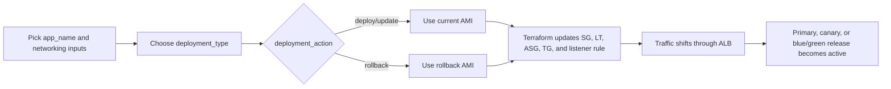

# Production Practice

This folder contains production-style Terraform practice for application-only releases.

Assumptions:
- The network, database, and shared platform layers already exist.
- You only provide app inputs such as the app name, deployment type, target networking rules, and release AMI details.
- The reusable module supports rolling, canary, blue/green, and rollback workflows.
- Pipeline examples are intentionally template-like so you can wire them into your own CI system.

## Layout

- `modules/app/`: reusable service stack for one microservice or frontend component.
- `pipelines/Jenkinsfile`: parameterized pipeline template for Terraform-driven app releases.
- `examples/`: sample variable files for common release patterns.

## Inputs you usually change

- `app_name`
- `deployment_type`
- `deployment_action`
- `host_header`
- `allowed_cidr_blocks`
- `allowed_security_group_ids`
- `app_ami_id`
- `rollback_ami_id`
- `secondary_ami_id`

## Deployment patterns

- Rolling: single ASG, launch template update, and instance refresh.
- Canary: weighted traffic across primary and secondary target groups.
- Blue/green: switch traffic between primary and secondary target groups.
- Rollback: restore a previous AMI and/or flip traffic back to the stable release.

## How to use

1. Copy one of the example files from `examples/` to a working `.tfvars` file.
2. Set the shared inputs for your service: `app_name`, `host_header`, `allowed_cidr_blocks`, and `allowed_security_group_ids`.
3. Pick the release mode by changing `deployment_type` and `deployment_action`.
4. Provide the current AMI in `app_ami_id` and, if needed, a previous AMI in `rollback_ami_id`.
5. Run Terraform from this folder or from the Jenkins pipeline template.

Example local workflow:

```sh
cd production-practice
terraform init
terraform plan -var-file=examples/rolling.tfvars.example
terraform apply -var-file=examples/rolling.tfvars.example
```

Suggested learning path:

- Start with `rolling.tfvars.example`.
- Switch to `canary.tfvars.example` and change the traffic split.
- Use `bluegreen.tfvars.example` to understand active/standby promotion.
- Use `rollback.tfvars.example` to see how the previous release is restored.

## Release flow



The diagram is intentionally simple: it shows how the inputs drive Terraform, and how Terraform changes the app stack and ALB traffic path.
